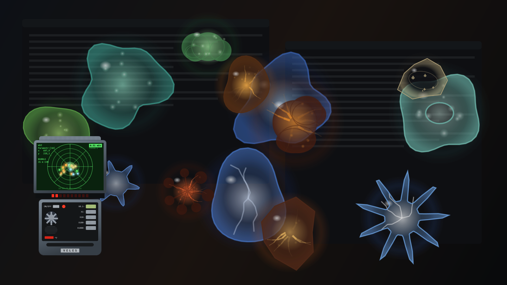
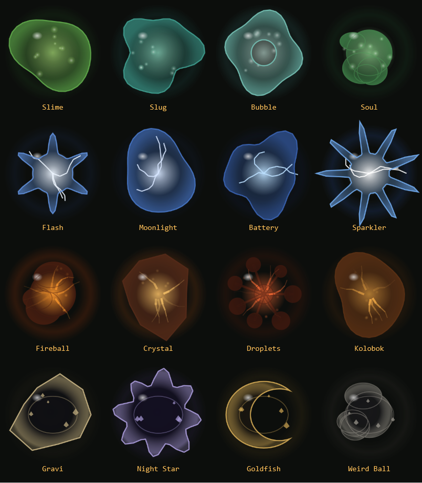
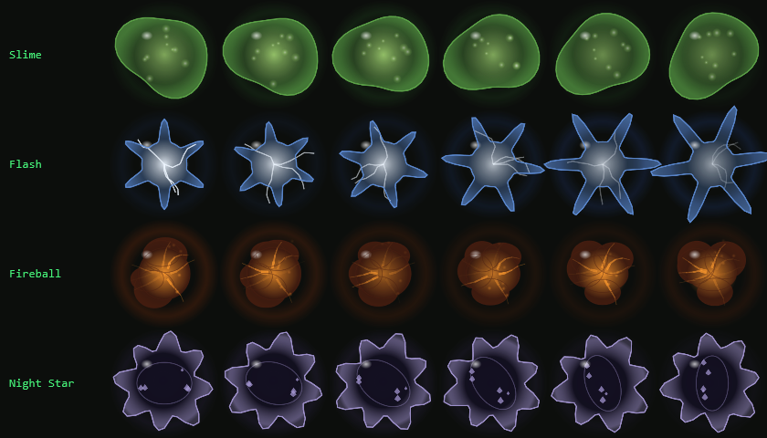
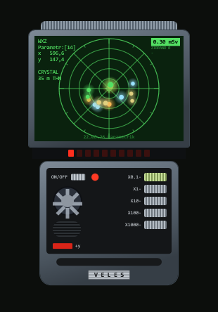
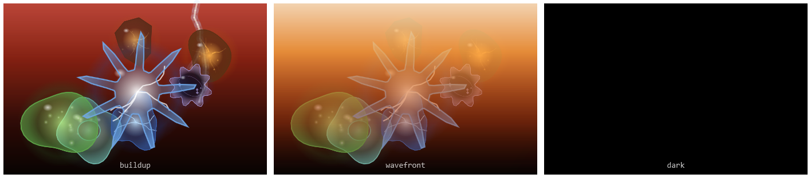
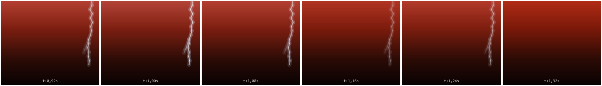
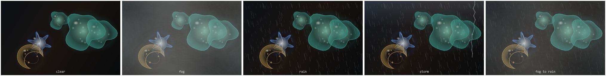
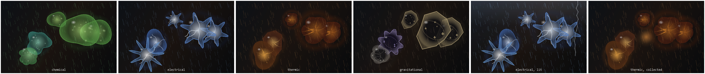
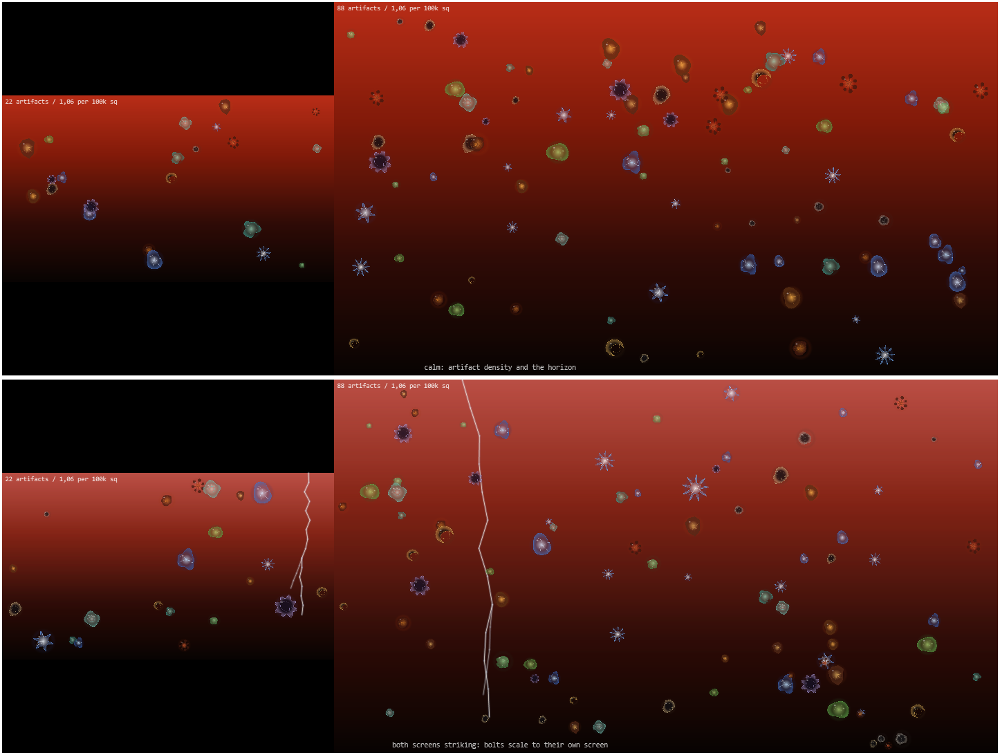

# Bubbles

[](https://github.com/zeusapps/BubblesScreenSaver/actions/workflows/ci.yml)
[](https://github.com/zeusapps/BubblesScreenSaver/releases/latest)

A transparent, click-through screensaver replacement for Windows that doesn't blank your
desktop — and that still runs when Windows' own screensaver can't.



---

## Why not just use `Bubbles.scr`?

Windows still ships the old Bubbles screensaver. Two things are wrong with it:

1. **It never starts if something holds a display request.** Tools that keep your machine
   awake — PowerToys Awake in "keep screen on" mode, media players, conferencing apps — set
   `ES_DISPLAY_REQUIRED`, which suppresses display sleep *and* the screensaver. Windows will
   simply never launch one while that flag is held. This app runs its own idle timer
   (`GetLastInputInfo`), so it doesn't care.
2. **The built-in screensaver freezes the desktop behind it.** It grabs a snapshot and draws
   over a dead image. This is a real always-on-top overlay, so whatever is underneath keeps
   running and keeps updating — you can watch a build scroll past through the artifacts.

## How it behaves

Three stages, driven purely by how long you've been away from the keyboard:

| Stage | When | What happens |
|---|---|---|
| Active | you're typing | nothing drawn, no cost |
| Artifacts | after `IdleSeconds` (default 60s) | they fade in over the live, dimmed desktop |
| Blackout | after `BlackoutSeconds` (default 10min) | an Emission, ending on solid black |

It also holds off entirely while you are **on a call** — see below. Any keypress or mouse
movement clears it instantly. The mouse pointer is hidden while the
overlay is up — a white arrow parked on one pixel is burn-in too — and comes straight back
on the first movement.

**No power states are ever touched.** Blackout is drawn, not a display-off command. See
[*A mistake worth not repeating*](#a-mistake-worth-not-repeating).

## Holding off

An idle timer measures input, and a video call produces none: you sit still, listening, and the
screensaver concludes you have left. So before anything is drawn, the app asks whether you are
actually busy:

| Signal | Default | Artifacts | Blackout | What it catches |
|---|---|---|---|---|
| `PauseWhileMicrophoneInUse` | on | held | held | any call, in any app — Teams, Zoom, Meet in a browser, Discord |
| `PauseWhileCameraInUse` | on | held | held | video on, microphone muted |
| `PauseInFullScreen` | on | held | held | a window filling a whole screen, a game, or presentation mode |
| `PauseWhileMediaPlaying` | on | held | **held for video, allowed for music** | what Windows says is playing, sound or no sound |
| `PauseWhileAudioPlaying` | on | held | held | anything making noise that registers no media session |

A reason names *which stages* it suppresses rather than vetoing everything, because watching and
listening are not the same thing. A film holds off the artifacts and the blackout both. An album
holds off the artifacts — nobody wants them thrown over the desktop — but the screen still
reaches black on schedule, because three hours of music must not keep an OLED lit. Where several
reasons hold at once, every stage any of them suppresses is suppressed.

**Watching a video is the awkward one.** It produces no input either, and the signal Windows
itself uses — a player asking for `ES_DISPLAY_REQUIRED` so the screen stays awake — is useless
here, because PowerToys Awake holds exactly that request permanently. That is the whole reason
this app measures idleness independently in the first place.

Fullscreen detection does not cover it on its own: a video in a window is not fullscreen at
all, and `SHQueryUserNotificationState` reports `FullScreenDirect3D` for a browser only
intermittently. So fullscreen is measured geometrically instead — the foreground window's
bounds against its monitor's — and sound is treated as a signal in its own right, because sound
coming out means somebody is listening to it.

The geometry compares all four edges for equality rather than asking whether the window covers
the screen. A maximised window overshoots its monitor by the width of its invisible resize
border and stops short at the bottom for the taskbar; a fullscreen one lands exactly on the
bounds. Testing coverage instead would work until somebody hides their taskbar, at which point
every maximised window would look fullscreen — the `QUNS_BUSY` mistake all over again.

Silence has to be a real zero for the audio check to be safe: an endpoint idling just above
zero would hold the screensaver off for ever. Sound heard within the last thirty seconds still
counts, so a pause in the dialogue or a gap between tracks does not let the screensaver in.

**But silence is not proof of absence.** *Sound coming out means somebody is listening* is sound
reasoning; the meter depends on its converse — *no sound means nobody is watching* — and that
one is false. Silent drone footage in a window defeats every signal above at once: no input, no
microphone, no camera, nothing filling a screen and nothing to hear. So does muted playback, a
clip with no audio track, and anything routed to an endpoint other than the metered one.

So the app also asks Windows what is playing, rather than asking the loudspeaker. The media
session records behind the taskbar's media flyout report, per player, whether it is playing and
whether it is video, music or an image — none of which depends on an audio track existing.

Only a session reporting **Playing** counts. The mere existence of one does not, and neither
does `Paused` or `Stopped`: a player left open overnight would otherwise hold the screensaver
off for ever, which is the `QUNS_BUSY` mistake again. If the sessions cannot be read at all,
nothing is held off — a permanently failing call must never be able to stop the screensaver
running, which is worse than a screensaver arriving during a film.

Not every player registers a session — `mpv` and some games do not — so the audio meter stays as
well. Between them they cover a player that makes no sound and a player that Windows knows
nothing about.

```
Bubbles.exe --media
```

lists every session Windows reports, what each says it is playing, and which stages that would
hold off.

```
Bubbles.exe --audio
```

samples the output level for ten seconds, and `--busy` prints the foreground window's geometry
alongside whatever is holding off, so both decisions can be inspected rather than guessed at.

Microphone and camera state comes from the records Windows keeps for the privacy indicator in
the taskbar: an app currently holding the device has a start time and no stop time. It needs no
elevation, covers packaged and desktop apps alike, and is what the operating system itself
trusts.

```
Bubbles.exe --busy
```

reports whether anything is holding the screensaver off, and names it.

A note on what is deliberately *not* used: `SHQueryUserNotificationState` returns `QUNS_BUSY`,
which sounds exactly right and is useless — it is true for any maximised window covering the
screen, which on a normal desktop is nearly always. Measured returning `Busy` for a plain
maximised terminal, which would have held the screensaver off permanently. Only exclusive
full-screen Direct3D and presentation mode are trusted.

**The countdown restarts when the hold-off lifts.** A call produces no input, so the system
idle timer climbs for its whole duration — hang up after forty minutes and a naive reading is
already past every threshold at once, so the bubbles arrive the instant the call ends, possibly
skipping straight to a black screen while you are still sitting there. Idle is therefore
measured from the end of the call until you touch something, by
[`IdleClock`](src/Bubbles/Session/IdleClock.cs).

Asking for an Emission from the tray still works while held off; if you ask for it, you get it.

## Asking for a PIN

Off by default. Tray → *Settings…* → *When it starts* → *Ask for a PIN after the black
screen*, or `"LockAfterBlackout": true`.

With it on, the session locks once the screen has actually reached black, so coming back needs
whatever already unlocks the machine — PIN, password or Windows Hello.

**It is Windows' own lock, not a prompt of ours**, and that distinction is the entire feature.
A PIN box drawn by this app would be theatre: the overlay is click-through and never holds the
keyboard, so Alt+Tab, the task manager, a remote session or just ending the process would each
walk straight past it — and it would have to keep a credential of its own to check against.
`LockWorkStation` hands over to the secure desktop, which no ordinary process can draw on or
listen to.

Two details worth knowing:

- It fires only once the screen has **reached** black, never while an Emission is still
  playing. Interrupting the animation leaves you where you were, rather than locking you out
  for walking past at the wrong moment.
- The displays are restored **before** the lock. A monitor dimmed over DDC/CI would otherwise
  be showing a sign-in prompt too dark to read, and the lock screen is the one thing this app
  cannot draw over to explain itself.

The screensaver is not a security boundary on its own — until the lock lands, the session is
merely idle. If you want the machine locked the moment it is unattended rather than when you
return to it, Windows' own *Settings → Accounts → Sign-in options → If you've been away* is the
thing to use, and the two work together happily.

---

## The Zone

Sixteen artifacts drift across the desktop, drawn in the four anomaly families:



| Family | Look |
|---|---|
| **Chemical** | acid green and oily teal, reagent bubbles suspended inside |
| **Electrical** | cold blue glass around a white-hot centre, discharge crawling over it |
| **Thermic** | a burnt crust with molten light in the fissures, embers lifting off |
| **Gravitational** | mangled matter that swallows light; only the rim survives |

They are **drawn live, not blitted**. The outline is a sum of slowly rotating harmonics, so it
genuinely changes shape, and each family animates its own interior — particles drifting,
discharge re-striking, fissures breathing, debris caught in orbit. Nine silhouette archetypes
(blob, chunky, spiky, shard, coil, starburst, crescent, cluster, beads) keep them from all
reading as the same ball.



Kinds are dealt from a **shuffled deck** rather than rolled independently, so every kind
appears once before any repeats — with sixteen kinds and twenty-two on screen, independent
rolls made duplicates a certainty.

Each artifact is bound to one monitor and the field deals them out round-robin, so a
multi-monitor desktop stays evenly populated. That also keeps them out of the region a shorter
monitor leaves behind in the virtual desktop, where nothing is actually displayed.

## The VELES detector



A detector **hunts** across the primary screen: it locks onto the nearest artifact and walks
towards it, keeping its quarry unless another is meaningfully closer, so it never dithers
between two equidistant contacts. Because it is always moving, it never parks long enough to
burn in.

The scope works like any radar: **the operator is fixed dead centre and the world moves around
it**. Blips sit at their true bearing and distance, colour-coded by family, and the monitor's
own edge is drawn as a rectangle sliding about — that rectangle is what tells you where on the
screen the detector currently is. The scale always keeps the whole monitor on the scope, even
with the detector pinned against a corner.

Everything on it is live: the radiation figure is computed from what is genuinely nearby, the
LED bar is that signal strength, and the lit range key follows the nearest contact.

**Artifacts get collected.** Drift within `CollectRadius` of the detector and the artifact is
picked up — the panel flashes, the tally goes up, and a replacement wanders in from a screen
edge. A short cooldown follows each pickup; without it, arriving in a crowded corner collected
four artifacts in two seconds, which read as hoovering rather than as finding something. Tuned
to roughly one pickup every six seconds. `CollectRadius: 0` switches it off.

## Emission



The blackout stage is an Emission. The sky burns crimson, **lightning strikes across it**, the
artifacts go frantic, a wavefront washes over everything, and then the Zone is dark. It still
ends on solid black, which on an OLED panel means genuinely unlit pixels.



Strikes are scheduled from the time into the Emission — sparse at first, crowding as the
pressure builds, finished before the sky collapses. Each one flickers three times and forks
once. They are drawn behind the artifacts, so those silhouette against the flash, and the layer
is only redrawn while a bolt is actually on screen. `Lightning: false` turns them off.

The schedule runs until it passes the moment the screen goes black, rather than to a fixed
count. It used to stop at 22 strikes, of which only 18 ever landed before the darkness — the
last four were scheduled where nobody could see them, and raising the count only added more of
those. Closing the gaps instead puts 27 on screen.

```
Bubbles.exe --emission-demo
```

runs a single Emission on demand and quits, which is the only sane way to look at one: waiting
for a real ten-minute idle works, but any stray mouse movement cancels it.

## Weather



The Zone has weather between Emissions: **clear**, **fog**, **rain**, and **rain with
lightning**. One is chosen at random, held for about a minute, and cross-faded into the next
over six seconds. The roll never picks the state already showing, so every change is one you
can see. A storm is meant to be an event, so it comes up least often.

It is one sky across the whole desktop — two monitors never disagree about the weather — but it
is drawn per screen, so its density follows each screen's own area.

Fog and rain sit *in front* of the artifacts. Behind them, fog fogs nothing: the artifacts stay
sharp over the top of it and the effect reads as a smear on the desktop instead. A storm's
lightning is the exception and stays behind them with the rest of the sky, quieter and rarer
than an Emission's — and an Emission is never mistakable for weather anyway, because it burns
the sky red.

### The weather belongs to the artifacts



The sky takes its colour from whatever is drifting in it. Whichever anomaly family holds the
most artifacts on screen tints the rain and the fog: Chemical acid-green, Electrical a cold
blue-white, Thermic amber, Gravitational muted. The colours are the artifacts' own, so the
palette is decided in one place.

A family has to lead by three artifacts to take the sky over, and a tint holds for twenty-five
seconds once it has. Sixteen kinds across four families leaves two of them within an artifact of
each other most of the time, and without the margin a single pickup would repaint the desktop. A
tint changes by the same six-second cross-fade a weather change uses.

**Lightning reaches the rain.** While a bolt is on screen the precipitation renders a couple of
rungs brighter, for exactly as long as the strike lasts — an Emission's strikes and a storm's
ambient ones alike. The lightning itself stays behind the artifacts where the sky belongs; it is
the rain that answers it.

**Collecting an artifact disturbs the sky**, at the detector, in that artifact's colour: a short
burst that fades on its own. Two families reach further than that. Electrical brings the storm's
next distant strike forward, and Thermic burns a clearing in the fog that closes again a couple
of seconds later. Both are the existing machinery given a different number, not new drawing.

None of it appears with weather switched off, or in the Soap theme, which has no sky.

Rain and fog are scrolling tiled brushes rather than anything redrawn per frame. Everything else
in the app that moves is either small, staggered across frames, or on screen for a fraction of a
second; weather is full-desktop and runs for as long as the screensaver does, so its motion is
handed to the compositor and costs nothing per frame. Intensity is baked into a ladder of
pre-built brushes for the same reason — compositing a desktop-sized layer at partial opacity,
every minute, for ever, is exactly what a cross-fade must not do. The ladder is 32 rungs: fewer
and a step across a desktop-wide fog sheet is large enough to see as banding, and rungs are free
because they all share one bitmap.

A tint is a different bitmap. Rasterising one costs 19–77 ms, so all of them are built at idle
priority when the window is created — long before the idle timeout draws anything. Built lazily
instead, the first frame that needed a family would be the frame that built it, which put the
stall on the exact frame the weather changed colour.

```
Bubbles.exe --weather-demo
```

walks through every state with the real cross-fades and quits. Weather changes about once a
minute in use, which is right for a screensaver and useless for looking at it.

`Weather: false` turns it off.

## Several monitors



The overlay is one window stretched over the whole virtual desktop, so every layer inside it is
laid out against the union of the screens — a rectangle no single monitor resembles. A laptop
panel beside a larger external is the case that shows what that costs.

Artifacts are spread by **area**, not by monitor. Dealing evenly gave both screens the same
count, which is four times the density on the smaller one. `BubbleCount` is therefore a density
— artifacts on a 1920×1080 screen — rather than a total, so connecting a monitor adds artifacts
instead of thinning out the screen already in front of you. A count stored under the old meaning
is converted once, against the layout present at the time, so an existing desk keeps the picture
it was tuned for.

Lightning is scheduled per screen too: each monitor gets its own storm rather than a share of
one, with bolts scaled by the height of the screen they land on rather than by the tallest one
attached. The schedules differ per screen, so the desk does not strobe as one. The sky and the
shockwave ramp their gradients over each screen's own height, so the horizon sits in the same
place on every one.

---

## Install

Download **`Bubbles.exe`** from the [latest release](https://github.com/zeusapps/BubblesScreenSaver/releases/latest)
and run it. No installer and no runtime to fetch — the released build is self-contained.

It has no window; look for the artifact in the notification area. Right-click it for
everything, including **Start with Windows**.

Windows will warn you on first run, because the binary is not signed by a certificate
authority — see [Code signing](#code-signing). To satisfy yourself the download is intact:

```powershell
Get-FileHash Bubbles.exe -Algorithm SHA256
```

and compare with `SHA256SUMS.txt` from the same release.

## Updating

The app checks its own releases page once a day, downloads anything newer in the background,
and **verifies it against the SHA-256 published with the release** before keeping it. The
binary is then *staged*, not swapped: the exchange happens at the next launch, or immediately
if you pick *Install v… and restart* from the tray.

Nothing restarts itself while you are working. Downloads that fail verification are discarded
and logged rather than installed.

Turn it off with `"AutoUpdate": false`, or slow it down with `"UpdateCheckHours"`.

**Builds from source do not self-update.** A source build is framework-dependent and keeps
`Bubbles.dll`, `deps.json` and `runtimeconfig.json` beside the launcher; dropping a
self-contained release binary into that folder leaves the sidecars behind and the new binary
dies at startup. Such a build reports that a newer version exists and tells you to `git pull`.

`Bubbles.exe --check-update` runs a single check and reports, without starting the overlay.

## Build

```
dotnet build                                      # src\Bubbles\bin\Debug\net10.0-windows10.0.17763.0\Bubbles.exe
dotnet test                                       # the suite below
dotnet publish src\Bubbles -c Release            # dist\Bubbles.exe (~200 KB, uses the installed .NET 10 runtime)
dotnet publish src\Bubbles -c Release -p:SelfContained=true   # portable, but ~75 MB more RAM at runtime
```

Framework-dependent is the default on purpose: this runs all day, and a compressed
self-contained bundle has to inflate itself into the process — measured at 226 MB resident
versus 151 MB.

## Layout

```
src/Bubbles/
  Program.cs App.cs        entry point and lifetime
  Settings.cs              the knobs, read from %APPDATA%\Bubbles\settings.json
  Zone/                    the artwork: artifacts, their silhouettes, the VELES, lightning
  Overlay/                 the transparent click-through window the artwork lives in
  Displays/                blackout: HDR, DDC/CI backlight, and what is owed back to each
  Session/                 idle detection, tray, settings window, updater, "are you on a call"
  Interop/                 the Win32 declarations
tests/Bubbles.Tests/
```

Layered downwards: `Zone` knows nothing about the window it is drawn in, `Overlay` knows
nothing about the idle timer that shows it, and `Displays` and `Interop` know nothing about
any of it.

## Tests

```
dotnet test
```

Most of this app is pixels and P/Invoke and is verified by looking at it. The tests cover the
part that is neither, and that had proved it needed them — the bookkeeping in
[`PendingRestore`](src/Bubbles/Displays/PendingRestore.cs) that decides what a display is owed
and when it is safe to forget.

Three separate releases fixed bugs in that logic, all with the same shape: a monitor unplugged
mid-blackout came back at zero brightness with nothing left to say what it should have been.
It was welded to the `dxva2.dll` calls, so the only way to provoke it was to pull a cable at
the right moment. Now it is a class with no hardware in it, and pulling the cable is a
one-line test:

```csharp
var settled = owed.Settle(_ => Array.Empty<string>(), "restore");   // nothing was reachable

Assert.Equal(0, settled.Restored);
Assert.Equal(1, owed.Count);                                        // ...so it is still owed
```

The rest covers the artifact deck (every kind appears before any repeats), the settings clamps
that stand between a hand-edited `settings.json` and an overlay you cannot dismiss, and the
updater's checksum lookup — which decides whether a downloaded executable gets run, and so
must return *no hash* rather than *some other file's hash*.

## Settings

Everything below is editable in tray → *Settings…*, which shows each value rather than only
whether it differs from a preset. The file behind it is
`%APPDATA%\Bubbles\settings.json`, still hand-editable; it is read at startup and written when
the settings window closes.

The window opens on its own with `--settings`, which is easier than driving the tray when you
are checking the layout at a scaling factor or on a second monitor:

```
Bubbles.exe --settings
```

The screensaver is held off while it is open — reading a settings window without touching the
keyboard is exactly what the idle timer would otherwise misread as absence.

The Theme group shows a picture of the selected theme, drawn by the same types the overlay
draws with rather than stored beside them, so it cannot go stale the way a screenshot would. It
is deliberately fixed: it says *which theme is this*, not what your own dimming and brightness
look like — the window cannot honestly answer that while it is holding the screensaver off.

| Key | Default | Meaning |
|---|---|---|
| `PauseWhileMicrophoneInUse` | true | hold off while any app is using the microphone |
| `PauseWhileCameraInUse` | true | hold off while any app is using the camera |
| `PauseInFullScreen` | true | hold off during full-screen Direct3D or presentation mode |
| `PauseWhileAudioPlaying` | true | hold off while sound is coming out of the machine |
| `PauseWhileMediaPlaying` | true | hold off for what Windows reports playing; video holds the blackout too, music does not |
| `IdleSeconds` | 60 | idle time before the artifacts appear |
| `BlackoutSeconds` | 600 | idle time before the screen goes black; `0` disables |
| `Dim` | 0.55 | how dark the sheet behind the artifacts is, 0–1 |
| `Opacity` | 0.85 | overall artifact opacity |
| `BubbleCount` | 22 | how many are alive on a 1920x1080 screen; a bigger desktop carries proportionally more |
| `MinRadius` / `MaxRadius` | 40 / 150 | size range, in device-independent pixels |
| `Speed` | 42 | average drift, DIP per second |
| `SpeedVariance` | 0.65 | 0 = uniform speed, 1 = wildly varied |
| `Buoyancy` | 0 | `0` bounces off all four edges; `~22` makes them float up and respawn below |
| `Wobble` | 0.045 | squash-and-stretch on top of the silhouette morph |
| `MaxFps` | 30 | frame cap; `0` follows the compositor |
| `FadeInSeconds` | 2.0 | fade-in length |
| `ClickThrough` | true | leave this on; false makes the overlay eat every click |
| `HideCursor` | true | hide the mouse pointer while the overlay is up |
| `Theme` | `Zone` | `Zone` for artifacts, `Soap` for plain soap bubbles |
| `Animated` | true | draw artifacts live; `false` keeps the shapes but freezes them |
| `CollectRadius` | 60 | how close an artifact must drift to be collected; `0` disables |
| `ShowDetector` | true | the hunting VELES detector (Zone theme only) |
| `Emission` | true | Emission instead of a plain fade to black (Zone theme only) |
| `Lightning` | true | lightning during an Emission, and the ambient strikes of stormy weather (Zone theme only) |
| `Weather` | true | fog, rain and storms drifting through between Emissions (Zone theme only) |
| `DimMonitorBacklight` | true | take external backlights to minimum over DDC/CI during blackout |
| `DisableHdrDuringBlackout` | true | switch HDR off while dark so the backlight can be dimmed |
| `MonitorStandby` | false | also ask external monitors to enter standby (darker, slower to wake) |
| `AutoUpdate` | true | check for, download and stage new releases |
| `UpdateCheckHours` | 24 | hours between update checks |

## OLED note

Artifacts moving over a *static* terminal don't protect the terminal's pixels — the text
underneath is still burning in. `Dim` is the lever that matters: on OLED, near-black is
genuinely-off pixels. `Dim: 0.9` keeps the desktop readable-ish while cutting almost all of the
emission, and `BlackoutSeconds` is the real fix.

## Monitors that are not OLED

Drawing black is a complete answer on OLED, where a black pixel is an unlit pixel. An LCD is
still backlit behind that black and goes on glowing in a dark room.

The obvious design would be to detect which panel is which. **Windows exposes no reliable way
to ask a display what technology it uses** — there is no such field in EDID, no WMI class for
it, and no public API. Guessing from model strings or from whether a panel is internal is
exactly the sort of assumption that works on one desk and breaks on the next.

So this asks about *capability* instead. Every monitor is offered a backlight change over
DDC/CI, and whichever accept one get it. That is correct for any arrangement — all OLED, none,
or a mixture — because black already covers OLED, and lowering an OLED's luminance does no
harm either. Nothing is treated differently for being internal or external.

Brightness over DDC/CI is a display-side setting, not a power state, so nothing about the
machine's power management is touched. The original value is written to disk *before* anything
changes and keyed by display device, so even a session that ends badly restores the right
monitor on the next run. `MonitorStandby: true` additionally asks monitors to enter standby,
which is darker still but slower to come back, and is off by default.

**The dim is held, not just set.** DDC/CI is a request, not a lock, and monitors put their own
backlights back up — an hour into a blackout the panel was lit again with nothing in Windows
having raised it and no display event logged, which points at the monitor resetting itself as
it leaves its internal power-save. So while the screen is dark the brightness is re-read every
twenty seconds and put back if it has moved. An undisturbed blackout costs one DDC read per
monitor per tick and writes nothing. A drift does not poison the record: the value the monitor
is owed stays the one captured before the first dim, never whatever it wandered to.

```
Bubbles.exe --hold-test
```

dims, shoves the brightness back to maximum the way a monitor would, and reports whether the
hold noticed. It needs HDR off on the monitor to mean anything, since HDR on makes every
brightness write a no-op.

```
Bubbles.exe --dim-test
```

lists every monitor by name, how it is connected, whether HDR is on, what backlight control it
supports, and whether a change actually took.

### HDR

While HDR is on, Windows owns the luminance pipeline and the monitor's DDC/CI channel is dead:
brightness *and* power-mode writes are accepted and silently discarded, and even
`GetMonitorCapabilities` fails. Confirmed on an ASUS XG27WCS over DisplayPort, where every
write returned success and changed nothing until HDR was switched off.

Only displays that stand to gain are touched: **HDR is switched off on external displays that
have it on, and never on the built-in panel**, which has no DDC/CI backlight to reach and so
would pay for a mode change and get nothing. A display you already have HDR off on is never
touched, and never switched on.

So the blackout switches HDR off first, waits for the displays to re-sync, and only then
touches the backlight. On the way back the order is reversed — **backlight restored first,
then HDR** — because re-enabling HDR kills DDC again, and restoring the other way round would
leave a monitor at zero brightness with no remaining way to reach it.

This is a display **mode change**: expect a second of black and a re-sync at each end, and
full-screen applications may not enjoy it. It only happens once the screen has already gone
black and once again when you come back. `DisableHdrDuringBlackout: false` turns it off and
leaves HDR alone, in which case an HDR monitor simply keeps glowing.

Every step is written to disk *before* it happens, so a session that ends badly is undone on
the next run. Verified by killing the process mid-blackout: HDR came back on the next launch.

Neither setting is forgotten if a monitor disappears mid-blackout. Brightness and HDR are each
cleared per display and only once the change has been *read back*, so a cable pulled while the
screen is dark leaves a record that is retried when the display returns and again at the next
launch. Windows persists HDR per display, so dropping that record would have left a monitor
with HDR off indefinitely.

### When a monitor ignores it

**Many monitors accept DDC writes and quietly ignore them.** They return success and change
nothing — a `True` from `SetMonitorBrightness` proves only that the message was sent. This app
reads the value back and reports the truth rather than claiming a monitor was dimmed while it
sits at full brightness.

If yours ignores them, in rough order of likelihood:

- **HDR is enabled** — see above; the app handles this itself unless you have turned that off.
- a **dock, hub or KVM** in the path — these frequently block the DDC channel;
- a **picture preset** (ASUS GameVisual, and equivalents) that locks brightness;
- a vendor utility holding the channel — ASUS DisplayWidget Center, Armoury Crate, and friends;
- **DDC/CI switched off** in the monitor's on-screen menu;
- **HDMI** rather than DisplayPort — DDC is generally more reliable over DP.

A quick independent check: if [Twinkle Tray](https://twinkletray.com/) or Monitorian cannot
change the brightness either, the problem is the monitor or the link rather than this app.

### The fallback that always works

**Let Windows sleep the displays.** That switches an LCD backlight off properly, which no
software overlay can do from the outside. It needs nothing holding `ES_DISPLAY_REQUIRED` — so
if you run PowerToys Awake, use plain "keep awake" rather than "keep screen on". The machine
stays up, Windows blanks the panels on its own timer, and this app's blackout covers the
interval before that happens.

## What the animation costs

Measured on a 2560×1600 desktop with 22 artifacts, as a percentage of **one** CPU core:

| Configuration | Cost |
|---|---|
| Soap bubbles (pre-rendered sprites), no detector | ~9% |
| Zone, `Animated: false` (same shapes, frozen) + detector | ~31% |
| Zone, `Animated: true` + detector | ~65–75% |
| Any theme, once the screen has gone black | ~1.5% |

Rendering stops once the screen actually reaches black, so the long tail of an idle night
costs almost nothing — measured at 30% of a core with artifacts on screen and 1.5% once dark,
with total system CPU roughly halving at that point.

**If your fans spin up shortly after the screen goes dark, it is worth checking what actually
caused it.** Going idle is also when Windows starts automatic maintenance, indexing and
antivirus scans, and whatever you left running keeps running. `tools/Watch-IdleCpu.ps1` samples
per-process CPU over time so you can see what is responsible rather than blaming whatever
happened to be on screen. On a many-core machine the top figure is a few percent of total CPU, but
it is real, and it runs while you are away. `Animated: false` keeps every shape and the detector for about a third
of the cost — tray → *Settings…* → *Theme* → *Animate artifacts*. `MaxFps` and `BubbleCount`
scale it further, and both are in the same window.

The gap is inherent to drawing vector content live: WPF re-rasterises it on every composition
pass, whereas a bitmap is a single textured quad. Several optimisations did land and are worth
knowing about if you touch this code:

- **Pre-baked alpha levels instead of `PushOpacity`.** Every push makes WPF render that subtree
  into an intermediate surface; a thermic artifact wanted fourteen of them per draw.
- **`BitmapCache` on the artifact bodies**, with `RenderAtScale` matched to on-screen size.
- **The halo split out to a static bitmap**, so the largest gradient is never re-rasterised.
- **Staggered redraws** — the drift updates every frame, the interior on a rota.
- **Tiled rib brushes baked to bitmaps** rather than `DrawingBrush`. A tiled `DrawingBrush` is
  re-rasterised from its geometry every pass; this one change was ~9 points of the detector.

## How the transparency works

- **Transparency** comes from `DwmExtendFrameIntoClientArea` with `-1` margins, not WPF's
  `AllowsTransparency`. The latter forces the whole window onto the software renderer; the DWM
  route keeps it hardware accelerated across a multi-monitor desktop.
- **The frame extension is re-asserted, not set once** — on show and on every display change,
  for the same reason topmost is re-asserted every three seconds and monitor brightness every
  twenty. A blackout performs two display mode changes per cycle (HDR off going in, HDR on
  coming out), and a window that loses the extension paints opaque with nothing to say why. The
  call is made where the window is already being repositioned, so it costs nothing on the render
  path, and a failure is logged rather than discarded.
- **The layers are settled before the artifacts fade in.** Once a property has been animated
  with `FillBehavior.HoldEnd`, the held value outranks anything assigned directly, so an
  interrupted blackout could otherwise leave the dimming sheet stuck at full black. Every layer
  is cleared and assigned its resting value on the way in, and those resting values are one
  table — `LayerRest` — rather than the endpoints of a dozen separate animations.
- **The overlay restores its own state before telling anyone.** Leaving a blackout raises
  `LeftDark`, which restores backlights over DDC/CI, changes HDR mode and may request a lock.
  That work used to run first, and a throw from it skipped every restore behind it — leaving the
  overlay opaque for the rest of the session.
- **Click-through** is `WS_EX_TRANSPARENT`, plus `WS_EX_NOACTIVATE` and `WS_EX_TOOLWINDOW` so it
  never takes focus or shows up in alt-tab.
- The window is stretched over the whole **virtual desktop** in physical pixels via
  `SetWindowPos`, and re-stretched on `DisplaySettingsChanged`. While hidden it collapses to a
  single pixel, because a window stretched over a large desktop holds a render surface that size
  even when nothing is drawn.

## A mistake worth not repeating

An earlier version implemented the third stage by broadcasting
`WM_SYSCOMMAND / SC_MONITORPOWER` to turn the monitor off, and re-sent it every four seconds to
defeat display-power requests from tools like PowerToys Awake.

On a **Modern Standby (S0ix)** machine — most current laptops — that message does not power
down the display. The OS treats it as *enter standby* and suspends the whole system. The retry
timer then turned it into a loop: wake the machine, four seconds later it goes back down. It
took a hard power-off to break, and the Windows System log recorded around ninety cycles of
`Event 506: entering Modern Standby, Reason: SC_MONITORPOWER`.

Notes for anyone tempted to add it back:

- There is no supported "display off, system still running" API under Modern Standby.
- `ES_DISPLAY_REQUIRED` only blocks *idle-triggered* sleep. It offers no protection against an
  explicit power command, so "fighting" it is fighting the user.
- Never put a system-wide power broadcast on a repeating timer. A single wrong call is
  recoverable; a retry loop is not.

Drawing black achieves the actual goal with none of that.

## Debugging

Set `BUBBLES_LOG=1` before launching to trace stage transitions, overlay opacities, detector
placement and artifact pickups to `%APPDATA%\Bubbles\log.txt`. `BUBBLES_SNAP=1` additionally
dumps what WPF believes it is drawing to `snap.png` after seven seconds; a comma-separated list
(`BUBBLES_SNAP=4,20,36`) writes one per moment, which is what a cross-fade needs — a single frame
cannot show one landing.

`BUBBLES_FRAMES=1` reports any frame that took longer than 33 ms, with a rolling worst, to the
same log. A screensaver that stutters is one somebody turns off, and a stutter is the single
defect that leaves no trace in a screenshot: the weather layer once froze the rain for a tenth of
a second while every test and every exported panel passed. All three are off by default and free
when off.

Note that `BUBBLES_SNAP` is not free while it fires — it renders the whole desktop to a bitmap
and PNG-encodes it on the UI thread, which costs ~240 ms and can provoke a large collection. Do
not judge frame times from a run that is also taking snapshots.

```
Bubbles.exe --glass-test
```

puts a known colour on screen, shows the overlay over it, captures the result and reports
whether the colour came through. This is the only way to observe the failure: the layer
opacities can be perfectly correct while the window still paints opaque, because that failure is
in the compositor rather than in WPF. Run it together with `BUBBLES_SNAP=1` and the two halves
separate — a `snap.png` showing artifacts over a dim desktop with this reporting black means the
frame extension is gone; a black `snap.png` means a layer is stuck.

`Bubbles.exe --export <dir>` renders the artifact sheet, the motion strip, the detector, the
three stages of an Emission and the hero shot to PNGs and exits — every image in this README is
produced by it, so the documentation cannot drift from the code.

**Screenshotting this app from PowerShell:** make the capturing process per-monitor DPI aware
*first* (`SetProcessDpiAwarenessContext(-4)`). Otherwise `SystemInformation.VirtualScreen`
reports virtualised bounds while `CopyFromScreen` copies physical pixels, so you silently
capture only the top-left corner of the desktop and every coordinate is off by the DPI scale.
That mismatch cost hours of chasing a rendering bug that did not exist.

---

## Code signing

Released binaries are **not currently signed**, so SmartScreen shows a "Windows protected your
PC" prompt on first run. That is expected for an unsigned open-source binary, and no amount of
self-signing fixes it — Windows trusts a signature only when it chains to a certificate
authority already in its trusted root store.

The release workflow is ready for a real certificate. Add two repository secrets and every
subsequent release is signed and timestamped automatically:

| Secret | Value |
|---|---|
| `SIGNING_PFX_BASE64` | the `.pfx`, base64-encoded |
| `SIGNING_PFX_PASSWORD` | its password |

Ways to get a certificate that Windows actually trusts:

- **[SignPath Foundation](https://signpath.org/)** — free code signing for open-source
  projects, which this qualifies as. Usually the right answer here.
- **Azure Trusted Signing** — a few dollars a month, but requires a verified organisation or
  three years of individual history.
- **A certificate authority directly** (Certum, DigiCert, Sectigo) — roughly $100–400 a year;
  since 2023 the key must live on hardware or in an approved HSM.

An OV certificate does not switch SmartScreen off immediately either; reputation accrues as
copies are downloaded. An EV certificate does.

`tools/New-SelfSignedCert.ps1` produces a self-signed certificate and prints the two secrets,
which is useful for exercising the pipeline. It will not stop the warning for anyone else.

## Disclaimer

This project is a fan-made screensaver and is **not affiliated with, endorsed by, or associated
with GSC Game World**. S.T.A.L.K.E.R. and S.T.A.L.K.E.R. 2: Heart of Chornobyl are trademarks of
GSC Game World.

No game assets are included or redistributed. Every artifact and every part of the detector is
drawn procedurally in code at runtime — the game's artbook and interface were used only as
visual reference, in the same way an artist works from a photograph.

## License

MIT — see [LICENSE](LICENSE).
